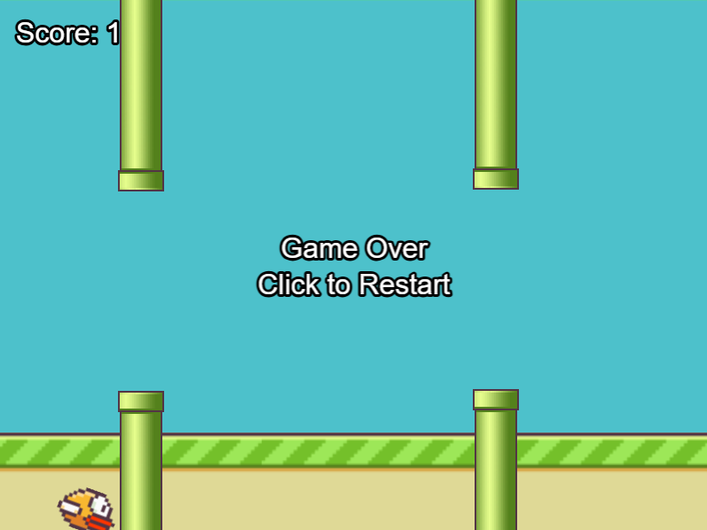

# Flappy Bird com Poderes

Uma versão modificada do clássico Flappy Bird, onde o pássaro pode atirar e destruir os canos! Desenvolvido com Phaser 3.



## Descrição
Este é um clone do Flappy Bird com uma mecânica adicional de tiro. O jogo mantém a jogabilidade clássica do Flappy Bird, onde você controla um pássaro amarelo que deve desviar de canos verdes, mas adiciona a capacidade de destruir os obstáculos atirando neles.

## Como Jogar

### Controles
- **Barra de Espaço**: Faz o pássaro pular
- **Tecla X**: Atira (novo poder!)

### Objetivo
- Evite colidir com os canos verdes
- Passe entre os canos para ganhar pontos
- Use os tiros para destruir os canos e ganhar pontos extras

### Sistema de Pontuação
- **+1 ponto**: Por passar entre os canos
- **+2 pontos**: Por destruir um cano com tiro

## Como Executar o Jogo

1. **Usando VS Code (Recomendado)**:
   - Instale a extensão "Live Server"
   - Clique com o botão direito no `index.html`
   - Selecione "Open with Live Server"

2. **Usando Python**:
   ```bash
   # Python 3
   python -m http.server 8000
   
   # Python 2
   python -m SimpleHTTPServer 8000
   ```
   Depois abra `http://localhost:8000` no navegador

3. **Usando Node.js**:
   ```bash
   # Instale o http-server globalmente
   npm install -g http-server
   
   # Execute na pasta do projeto
   http-server
   ```
   Acesse `http://localhost:8080` no navegador

## Tecnologias Utilizadas

- HTML5
- JavaScript
- [Phaser 3](https://phaser.io/phaser3) - Framework de jogos
- Sprites do Flappy Bird original

## Estrutura do Projeto

```
flappy-bird/
│
├── index.html      # Página principal do jogo
├── game.js         # Lógica do jogo
└── README.md       # Este arquivo
```

## Características

- Física realista do pássaro
- Geração procedural de obstáculos
- Sistema de pontuação
- Mecânica de tiro (característica única!)
- Fundo e chão em movimento
- Animação de rotação do pássaro
- Sistema de Game Over com reinício

## Dicas

1. Mantenha um ritmo constante de pulos
2. Use os tiros estrategicamente para criar passagens mais largas
3. Não desperdice tiros - mire com precisão!
4. Observe o padrão de movimento dos canos

## Contribuindo

Sinta-se à vontade para fazer um fork e enviar pull requests com melhorias!

Algumas ideias para contribuições:
- Adicionar sons
- Implementar power-ups
- Adicionar diferentes tipos de tiros
- Criar um sistema de high score
- Adicionar diferentes fases ou dificuldades

## Licença

Este projeto é distribuído sob a licença MIT. Veja o arquivo `LICENSE` para mais detalhes. 